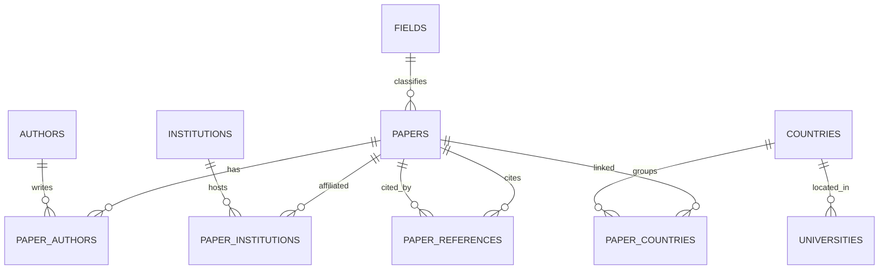

# Paper Citation Explorer — Implementation Plan

**Course:** Architektura Systemów Informatycznych — Mini-projekt (PW, MiNI)
**Document type:** Full implementation & design plan (single source of truth)
**Status:** Plan approved for build · scheduling removed · one-time ~5 GB load

---

## 1. What we are building

A layered data system that ingests scholarly metadata from open-data sources, stores it in MySQL, exposes it through a REST API, and presents it in a Streamlit frontend with two views:

1. **Citation graph** — pick a paper, toggle between *cites* (works it references) and *is cited by* (works that reference it), explore an interactive node-link graph. Clicking a node opens a detail panel.
2. **Country analytics** — pick an OpenAlex field or domain and rank countries, including productivity ratios that reveal countries producing many papers relative to a small GDP or few higher-education institutions.

Three open-data sources are used (the rubric requires ≥ 2): **OpenAlex**, **universities.hipolabs.com**, **World Bank Open Data API**.

---

## 2. Requirements, clarified and resolved

This section records every decision so there is no ambiguity during the build.

### 2.1 Changes from the latest discussion (authoritative)

| # | Decision |
|---|---|
| C1 | **No scheduler.** The database is populated **once** via a CLI pipeline. APScheduler is removed from the design. |
| C2 | **Dataset target ≈ 5 GB** of *relatively popular* papers (most-cited first). Ingestion is **size-monitored** and stops near the target. |
| C3 | **Capped displayed nodes** in the graph stay (default 50, ordered by citations). |
| C4 | The graph view and the right panel both show the paper's **total number of citing papers** (`cited_by_count`) as a distinct field — independent of how many nodes are actually drawn (e.g. *"Cited by 12,453 papers — showing top 50"*). |
| C5 | Tab 2 ratios: rank by **papers / GDP** and **papers / number of educational institutions** (plus papers / capita) to surface countries punching above their economic or institutional weight. |
| C6 | Right 1/3 panel must additionally show **DOI** and **cited-by count** (alongside title, authors, abstract, open-access indicator). |

### 2.2 Resolved inconsistencies

1. **World Bank URL.** `https://data.worldbank.org/` is the portal, not the API. We use `https://api.worldbank.org/v2/`. Indicators: GDP (current US$) = `NY.GDP.MKTP.CD`, population = `SP.POP.TOTL`, taking the most-recent non-empty value per country (`mrnev=1`).
2. **A paper has no single country.** Country comes from each author's institution (`authorships[].institutions[].country_code`, ISO-2). A paper is linked to **every** country among its authors' institutions (table `paper_countries`).
3. **"Educational institution"** is a per-institution attribute (`institutions[].type == "education"`). A derived boolean `is_educational` on the paper = *any* affiliated institution is educational.
4. **Country-code reconciliation.** OpenAlex = ISO-2 (`PL`); World Bank = ISO-3 (`POL`) but its country list also exposes `iso2Code`; hipolabs = ISO-2 + full name. **Canonical key = ISO-2.** World Bank's own `iso2Code` bridges ISO-3 → ISO-2. This is the "normalize the data" integration concern from the SOA/EAI lecture.
5. **Scale.** OpenAlex has 250M+ works. Population is **field/domain-scoped or popularity-scoped**, never "everything". The corpus is the most-cited works until the size target is hit.
6. **"Is cited by" completeness.** Stored intra-corpus reverse edges by default; a `live=true` switch augments from OpenAlex (`filter=cites:<id>`) on demand. DB-first keeps it fast (the lecture's "1 HTTP call ≈ 1000× a local call").
7. **Field vs domain.** OpenAlex hierarchy = Domain → Field → Subfield → Topic. *"Agricultural and Biological Sciences"* is a **Field**; *"Life Sciences"* is its **Domain**. Tab 2 supports either.
8. **Abstracts.** `abstract_inverted_index` (`{word: [positions]}`) is decoded back to text; `null` is handled (no abstract); long abstracts are truncated in the UI only.
9. **IDs.** OpenAlex ids are URLs (`https://openalex.org/W2741809807`). We store the short form (`W2741809807`) as primary key and normalize `referenced_works` the same way so edges join cleanly.

---

## 3. Architecture

Closed, top-down layered architecture (Lecture 1): each request flows through the layers; the frontend never reaches the database directly (separation of concerns, loose coupling).

```
┌──────────────────────────────────────────────────────────────────────┐
│  Open Data sources                                                    │
│  OpenAlex API · universities.hipolabs.com · World Bank API            │
└───────────────┬───────────────────────────────────────────────────────┘
                │  HTTP (httpx + retry/backoff, polite-pool mailto)
┌───────────────▼───────────────┐
│  Ingestion layer              │  typed clients, pagination/cursor
└───────────────┬───────────────┘
┌───────────────▼───────────────┐
│  Processing / parsing layer   │  decode abstracts, normalize ids,
│                               │  derive country set & is_educational,
│                               │  reconcile country codes
└───────────────┬───────────────┘
┌───────────────▼───────────────┐
│  Storage layer — MySQL 8      │  SQLAlchemy ORM, normalized schema
└───────────────┬───────────────┘
┌───────────────▼───────────────┐
│  Backend API — FastAPI (REST) │  JSON, auto Swagger /docs, HTTP codes
└───────────────┬───────────────┘
┌───────────────▼───────────────┐
│  Frontend — Streamlit         │  graph (agraph) + analytics tabs
└───────────────────────────────┘

Crosscutting (all layers): loguru logging · Pydantic validation ·
error handling · caching (HTTP cache + Streamlit cache)
Orchestration: one-time population pipeline (CLI)
Runtime: Docker Compose — dev / test / prod
```

The documentation will contain **C4 diagrams** (Context, Container, Component) and a **UML deployment diagram** as Mermaid, satisfying the "czytelna wizualizacja" point.

---

## 4. Technology stack & justification

(Directly feeds the rubric's *uzasadnienie wyboru każdej technologii* points.)

| Layer | Choice | Justification |
|---|---|---|
| Language | Python 3.12 | Required; one language across the stack |
| Backend | FastAPI + Uvicorn | REST + JSON, Pydantic validation, **auto OpenAPI/Swagger** at `/docs` (Lecture 4: code-first, spec generated automatically) |
| ORM / driver | SQLAlchemy 2.0 + PyMySQL | DB-agnostic → MySQL in prod, SQLite in tests |
| Database | MySQL 8 | Required; relational model fits normalized papers/authors/institutions + a citation **edge list** |
| Frontend | Streamlit + `streamlit-agraph` | Required frontend; agraph gives an interactive node-link graph that returns the clicked node id |
| HTTP client | httpx + tenacity | Timeouts, retries, exponential backoff against flaky public APIs |
| Logging | loguru | Required; configured once as a crosscutting concern, logs to stderr (Docker/Loki) + rotating file |
| Config | pydantic-settings | 12-factor; same image, different env vars per environment |
| Tests | pytest + locust | Unit + basic load/performance (rubric requires both) |
| Runtime | Docker + Compose | Multi-stage slim images, non-root user, healthchecks, service discovery by name (Lecture 6) |

---

## 5. Data sources & integration notes

### 5.1 OpenAlex (`https://api.openalex.org`)
- No mandatory API key. Identify with `mailto=<email>` to join the **polite pool** (faster, more stable). Optional premium key → `OPENALEX_API_KEY` (see §10).
- Seed query: `/works?filter=primary_topic.field.id:<field>&sort=cited_by_count:desc&per-page=200` with cursor paging (`cursor=*` → `meta.next_cursor`).
- Popularity (global) seed alternative: `/works?sort=cited_by_count:desc` filtered by one or more domains.
- Reduce payload with `select=id,doi,title,publication_year,cited_by_count,referenced_works,abstract_inverted_index,open_access,authorships,primary_topic`.
- Batch enrichment of referenced works: `/works?filter=openalex_id:W1|W2|...&select=...` (~50 ids/request).
- Live "cited by": `/works?filter=cites:<id>&per-page=<cap>`.
- Useful reference endpoints: `/fields`, `/domains` (to verify ids — e.g. Life Sciences domain, Agricultural & Biological Sciences field).

### 5.2 universities.hipolabs (`http://universities.hipolabs.com/search`)
- Full dump (~9k+ records): `GET /search` (optionally `?country=<name>`). Note: HTTP only (no TLS) — minor security caveat, fine for read-only public data.
- Fields used: `name`, `country`, `alpha_two_code` (ISO-2), `web_pages`, `domains`.
- Loaded once; aggregated to `countries.num_universities` per ISO-2.

### 5.3 World Bank (`https://api.worldbank.org/v2`)
- Countries: `/country?format=json&per_page=400` → `id` (ISO-3), `iso2Code`, `name`, `region` (skip aggregates where `region.value == "Aggregates"`).
- GDP: `/country/all/indicator/NY.GDP.MKTP.CD?format=json&mrnev=1&per_page=20000`.
- Population: `/country/all/indicator/SP.POP.TOTL?format=json&mrnev=1&per_page=20000`.

---

## 6. Database schema



| Table | Key columns | Notes |
|---|---|---|
| `papers` | id (PK, short OpenAlex id), doi, title, publication_year, **cited_by_count** (total citing papers), referenced_works_count, is_open_access, oa_status, oa_url, is_educational, primary_field_id/name, primary_domain_id/name, abstract (MEDIUMTEXT), ingested (bool) | `ingested=False` = lightweight stub created by enrichment |
| `authors` | id (PK), display_name, orcid | shared across papers |
| `institutions` | id (PK), display_name, country_code (ISO-2), type, ror | `type` drives `is_educational` |
| `paper_authors` | paper_id, author_id, author_position | M:N |
| `paper_institutions` | paper_id, institution_id | M:N |
| `paper_countries` | paper_id, country_code | M:N, **derived**; join key for Tab 2 |
| `paper_references` | citing_id → papers, referenced_id → papers | directed **citation edge list** (cites = out, cited_by = in) |
| `countries` | code (PK ISO-2), iso3, name, gdp_usd, gdp_year, population, population_year, num_universities | merged World Bank + hipolabs |
| `universities` | id (PK), name, country_code, country_name, web_page, domains | hipolabs, one-time load |
| `fields` | id (PK), name, domain_id, domain_name | populated from corpus; Tab 2 dropdown |
| `ingest_runs` | id, scope, started_at, finished_at, papers_ingested, db_size_bytes, status, message | auditing/debug |

**Indexing for performance:** `papers.cited_by_count` (sorting), `papers.primary_field_id`, `papers.primary_domain_id`, `paper_references.citing_id`, `paper_references.referenced_id`, `paper_countries.country_code`, FK indexes everywhere. The raw schema lives in `sql/001_schema.sql`; SQLAlchemy `metadata.create_all` is the safety net.

---

## 7. Database population (one-time, ~5 GB, size-monitored)

A single command: `python scripts/run_pipeline.py --scope <field:ID | domain:ID | popular> --target-gb 5`.

- **Phase 0 — schema.** MySQL runs `sql/001_schema.sql` on first boot; ORM `create_all` ensures parity.
- **Phase 1 — reference data (independent of the corpus).**
  1. hipolabs `/search` full dump → upsert `universities`; aggregate per-country counts.
  2. World Bank country list (ISO-3↔ISO-2 + names), GDP (`mrnev=1`), population (`mrnev=1`) → upsert `countries` (gdp, population, num_universities).
- **Phase 2 — corpus (the popular seed set).** OpenAlex `/works` sorted by `cited_by_count:desc` (within the chosen field/domain, or global). For each work: upsert paper (`ingested=True`) + authors + institutions + `paper_authors` + `paper_institutions` + derived `paper_countries` + `is_educational`; upsert `fields`; record edges to `referenced_works` in `paper_references`. After every batch, **check `information_schema.tables` for current DB size and stop when ≈ `target-gb`.**
- **Phase 3 — graph enrichment.** Collect `referenced_id`s not yet present (capped by `max_enrichment_ids`), batch-fetch minimal fields, insert as stub papers so every graph node has a title + citation count.
- **Phase 4 — finalize.** Write `ingest_runs`; log counts (papers, authors, institutions, edges, countries, final size).

All writes are **upserts** → the pipeline is idempotent and resumable after an interruption.

### 7.1 Dataset sizing (rough, monitor rather than trust)

Per fully-ingested popular paper the footprint is dominated by the abstract (~1.5 KB) and the reference edge list (often 30–60 edges with indexes). Effective footprint ≈ **7–12 KB/paper** including amortized shared rows and enrichment stubs.

| Target | Approx. fully-ingested papers |
|---|---|
| ~1 GB | ~100k |
| ~2.5 GB | ~250k |
| ~5 GB | **~400k–700k** |

These are estimates; the pipeline **measures actual size each batch and stops at the target**. Size levers: turn reference enrichment on/off, narrow/broaden the field/domain scope, store or skip abstracts.

### 7.2 Ingestion time expectation

A ~5 GB load means thousands of seed requests (200/page) plus tens of thousands of enrichment requests (50/batch). At polite-pool throughput plus DB write time this is roughly **1–4 hours**, I/O-bound. (For very large loads, OpenAlex also publishes a full S3 snapshot for bulk import — noted as an alternative, but API paging is simpler for this project.)

---

## 8. Backend API

| Endpoint | Returns |
|---|---|
| `GET /api/health` | liveness/readiness |
| `GET /api/fields` | fields & domains present in the corpus (Tab 2 dropdown) |
| `GET /api/papers/search?q=&field_id=&domain_id=&limit=` | seed-paper picker (Tab 1) |
| `GET /api/papers/{id}` | **title, authors[], abstract, DOI, cited_by_count, open-access (is_oa, oa_status, oa_url), year, field/domain** (right panel) |
| `GET /api/papers/{id}/graph?direction=cites\|cited_by&limit=50&live=false` | `{ focus: {id,title,cited_by_count}, nodes[], edges[], total_related, shown }` (Tab 1 graph; `total_related` = full count, `shown` = capped) |
| `GET /api/fields/{field_id}/country-ranking?order_by=citations\|papers\|universities\|gdp\|population\|papers_per_gdp\|papers_per_university\|papers_per_capita&limit=` | per-country block (Tab 2) |

**Country-ranking row** (Tab 2):

```json
{
  "country_code": "NL",
  "country_name": "Netherlands",
  "paper_count": 4821,
  "total_citations": 1932044,
  "num_universities": 53,
  "gdp_usd": 1.01e12,
  "population": 17900000,
  "papers_per_100b_gdp": 477.3,
  "papers_per_university": 91.0,
  "papers_per_million_capita": 269.3,
  "top_paper": { "id": "W...", "title": "...", "cited_by_count": 88123, "doi": "10.xxxx/..." }
}
```

Ratios guard against missing/zero GDP, population, or university counts (returned as `null`, sorted last). Standard HTTP codes: 404 (unknown paper/field), 422 (validation). Every response is Pydantic-typed → full Swagger schemas at `/docs`.

---

## 9. Frontend (two tabs)

### Tab 1 — Citation graph
- Search box → choose a seed paper.
- `cites` / `is cited by` segmented toggle; optional **"fetch live cited-by"** checkbox.
- **Left 2/3:** `streamlit-agraph` node-link graph; nodes labeled by truncated title; the focus paper is highlighted; header shows **"Cited by N papers — showing top {cap}"** (C4).
- **Right 1/3:** on node click → **Title · Authors · DOI (link to doi.org) · Cited-by count · Abstract · Open-Access badge** (green "Open Access" + oa_status, grey "Closed", with link when available) (C6).

### Tab 2 — Country analytics
- Pick a **Field** or **Domain** (from `/api/fields`).
- Pick a sort metric, including the productivity ratios from C5.
- Ranked country table: paper_count, total_citations, num_universities, GDP, population, **papers/GDP**, **papers/university**, papers/capita, and the **single most-cited paper** from that country (title links to OpenAlex/DOI).
- A bar chart of the chosen metric; ratio views naturally surface "above-weight" countries.

---

## 10. Secrets & configuration — where the API key is stored

**Answer in one line:** keys live in a **`.env` file at the repo root that is git-ignored**, are loaded as **environment variables** via `pydantic-settings`, injected into containers through Docker Compose, and replaced by **Docker secrets / the orchestrator's secret store in production**. Keys are **never hardcoded, never committed, never logged**.

Mechanics:
- `.env` (real values) → listed in `.gitignore`, never committed.
- `.env.example` (placeholders only) → committed, documents every variable.
- `app/config.py` reads them via `pydantic-settings` (`Settings`), so code never sees a raw literal.
- Dev/test: Compose `env_file: .env` (or `environment:`) passes them in.
- Prod: use **Docker secrets** (mounted at `/run/secrets/...`) or the host secret manager; `restart: always`; debug off.
- loguru is configured to **never** include secret values in log lines.

Per source:
- **OpenAlex** — no mandatory key. Set `OPENALEX_MAILTO` (polite pool). Optional premium key → `OPENALEX_API_KEY` in `.env`.
- **World Bank** — no key required.
- **hipolabs** — no key required.
- **MySQL** — credentials (`MYSQL_USER`, `MYSQL_PASSWORD`, `MYSQL_DATABASE`) also live in `.env` / Docker secrets, never in code or compose literals for prod.

---

## 11. Implementation in 3 parts

The work splits into three cohesive parts. Each part is an ownership area (maps to the rubric's *responsibility of participants*) and a milestone if working solo. Parts integrate through clear contracts: Part 2 depends on Part 1's schema; Part 3 depends on Part 2's OpenAPI contract.

### Part 1 — Data foundation & ingestion (the "data" owner)
**Scope:** Docker MySQL service + named volume; `sql/001_schema.sql`; SQLAlchemy models; the three source clients (OpenAlex, hipolabs, World Bank) with retries/backoff/timeouts; the processing/transform layer (abstract decoding, id normalization, country-code reconciliation, `is_educational` and `paper_countries` derivation); the one-time, size-monitored population pipeline; loguru logging for ingestion.
**Deliverables:** a reproducible ~5 GB MySQL dataset; `scripts/run_pipeline.py`; `ingest_runs` audit rows.
**Done when:** `run_pipeline.py` loads to target size idempotently and the tables contain papers, authors, institutions, edges, and country reference data.

### Part 2 — Backend API (the "API" owner)
**Scope:** FastAPI app; repository/query layer (paper detail, graph cites/cited-by with caps + live option, country ranking with ratios, top-cited-paper-per-country); Pydantic schemas; error handling + standard HTTP codes; response caching; Swagger at `/docs`; backend Dockerfile (multi-stage, non-root, healthcheck).
**Deliverables:** all endpoints in §8, documented OpenAPI contract, API tests (SQLite TestClient).
**Done when:** every endpoint returns correct typed JSON against a seeded DB and Swagger renders the full contract.

### Part 3 — Frontend, integration & delivery (the "frontend/integration" owner)
**Scope:** Streamlit two-tab app + `api_client.py` (talks only to the backend); agraph graph with node-click → detail panel (incl. DOI + cited-by + OA badge); country analytics tab with ratio sorting + chart; the full `docker-compose.yml` + `dev`/`test`/`prod` overrides + service discovery; performance tests (pytest timing + locust); documentation (README, ARCHITECTURE+C4/UML, DATABASE, TECH_CHOICES, API); the 10-minute demo.
**Deliverables:** running UI, green test suite, complete docs, demo script.
**Done when:** `docker compose up` brings up MySQL + backend + frontend and both tabs work end-to-end against the loaded data.

**Integration checkpoints:** (a) Part 1 freezes the schema → Part 2 starts; (b) Part 2 freezes the OpenAPI contract → Part 3 wires the UI; (c) a joint end-to-end pass on the 5 GB dataset before the demo.

---

## 12. Testing strategy

- **Unit tests** (SQLite, all HTTP mocked): abstract inverted-index decoder; OpenAlex work parser (fixtures); World Bank parser; country-code normalization (ISO-3→ISO-2, name matching); ratio math (incl. divide-by-zero/missing data).
- **API tests:** FastAPI `TestClient` against an in-memory SQLite DB seeded with fixtures — no MySQL or network needed for the suite to pass.
- **Performance tests:** pytest timing asserts on hot endpoints (paper detail, graph, ranking) + a `locust` file for API load testing. Satisfies "testy jednostkowe + podstawowe testy wydajnościowe".

---

## 13. Containerization & environments

- `docker/backend.Dockerfile`, `docker/frontend.Dockerfile`: **multi-stage**, `python:3.12-slim`, non-root `USER`, `HEALTHCHECK`, `.dockerignore`.
- `docker-compose.yml` (base): `mysql` (named volume, init SQL), `backend`, `frontend`; services reach each other by name (`http://backend:8000`, `mysql:3306`).
- `docker-compose.dev.yml`: hot-reload (`--reload`), source bind-mounts, exposed ports.
- `docker-compose.test.yml`: runs `pytest` in a container.
- `docker-compose.prod.yml`: uvicorn workers, `restart: always`, no reload, secrets.
- Earns the rubric's Docker points (1 each for **dev / test / prod**).

---

## 14. Project structure

```
paper-citation-explorer/
├── app/
│   ├── config.py  logging_config.py
│   ├── db/         database.py  models.py
│   ├── schemas/    schemas.py
│   ├── ingestion/  openalex_client.py  universities_client.py  worldbank_client.py  abstract.py
│   ├── processing/ transform.py
│   ├── repository/ papers.py  countries.py
│   ├── pipeline/   populate.py            # one-time, size-monitored (no scheduler)
│   ├── api/        main.py  deps.py  routers/{papers,graph,fields,countries}.py
│   └── frontend/   streamlit_app.py  api_client.py
├── docker/         backend.Dockerfile  frontend.Dockerfile
├── sql/            001_schema.sql
├── scripts/        run_pipeline.py
├── tests/          unit + api (SQLite TestClient) + test_performance.py + locustfile.py
├── docs/           ARCHITECTURE.md (C4+UML)  DATABASE.md  TECH_CHOICES.md  API.md
├── docker-compose.yml + .dev/.test/.prod overrides
├── requirements.txt  requirements-dev.txt
├── .env.example  .dockerignore  .gitignore  Makefile  README.md
```

---

## 15. Difficulty assessment

**Overall: moderate-to-high — broad rather than deep.** No hard algorithms; the challenge is full-stack breadth, public-API integration quirks, and handling a 5 GB one-time load reliably.

| Component | Difficulty | Why |
|---|---|---|
| Schema design | Medium | Citation edge list + derived links need thought |
| OpenAlex ingestion | Medium | Cursor paging, polite pool, retries |
| World Bank + hipolabs + country reconciliation | Medium | ISO-2/ISO-3 + name matching is fiddly; missing data |
| ~5 GB one-time load | Medium-High | Long-running, idempotent, resumable, size-monitored |
| Backend API + Swagger | Easy-Medium | FastAPI does the heavy lifting |
| Country analytics SQL (top paper/country + ratios) | Medium | Grouping + ratio edge cases |
| Streamlit + agraph + click→panel | Medium | agraph quirks, performance with many nodes |
| Tests (unit + perf + SQLite API) | Medium | MySQL↔SQLite parity, mocking HTTP |
| Docker dev/test/prod | Medium | Multi-stage, non-root, healthchecks, secrets |
| Docs + C4/UML | Easy-Medium | Mostly writing + Mermaid |

**Main risks:** OpenAlex rate limits / long ingestion windows; data quality (missing country, GDP, or university counts); graph rendering performance (mitigated by the node cap); producing a *genuine* git history (commit per milestone, not one big upload); MySQL↔SQLite parity in tests.

**Effort estimate:** roughly **60–100 person-hours** total → about **3 people × ~3 weeks part-time**, or one focused person over ~3–4 weeks. The 5 GB load and the polished frontend are the time sinks.

**Rating: ~6.5 / 10** for a 2nd–3rd-year team — very achievable, with the integration glue and data volume (not the code) being the demanding parts.

---

## 16. Rubric coverage map

| Rubric item | Where covered |
|---|---|
| Layered architecture (3) | §3 |
| ≥ 2 data sources (2) | §5 (three sources) |
| Key components: ingestion/processing/DB/backend/frontend (2) | §3, §14 |
| C4/UML visualization (1) | §3, `docs/ARCHITECTURE.md` |
| Full pipeline (3) | §7 |
| Working REST API (2) | §8 |
| Working frontend + UX (2) | §9 |
| Error handling/resilience (1) | retries/backoff (§5), HTTP codes (§8), idempotent pipeline (§7) |
| Unit + perf tests (2) | §12 |
| Logging/debugging (1) | loguru, §3/§10 |
| Code structure/readability (1) | §14 |
| Git history (1) | Appendix commit plan |
| Docker dev/test/prod (3) | §13 |
| Architecture + components + participant responsibility (2) | §3, §11 |
| API docs / Swagger (1) | §8 |
| Tech justification (1) | §4 |
| Presentation + demo (2) | §11 Part 3 |

---

## Appendix — suggested git milestones & run commands

**Commit plan (real history, not one upload):** `init scaffolding` → `db schema + models` → `ingestion clients` → `processing/transform` → `population pipeline` → `backend api + schemas` → `country analytics endpoint` → `streamlit graph tab` → `streamlit analytics tab` → `docker dev/test/prod` → `tests (unit/api/perf)` → `docs + diagrams`.

**Run:**
```bash
cp .env.example .env                      # fill OPENALEX_MAILTO etc.
docker compose -f docker-compose.yml -f docker-compose.dev.yml up -d   # mysql + backend + frontend
docker compose exec backend python scripts/run_pipeline.py --scope popular --target-gb 5
# Frontend:  http://localhost:8501    API docs: http://localhost:8000/docs
docker compose -f docker-compose.yml -f docker-compose.test.yml run --rm tests   # pytest
```