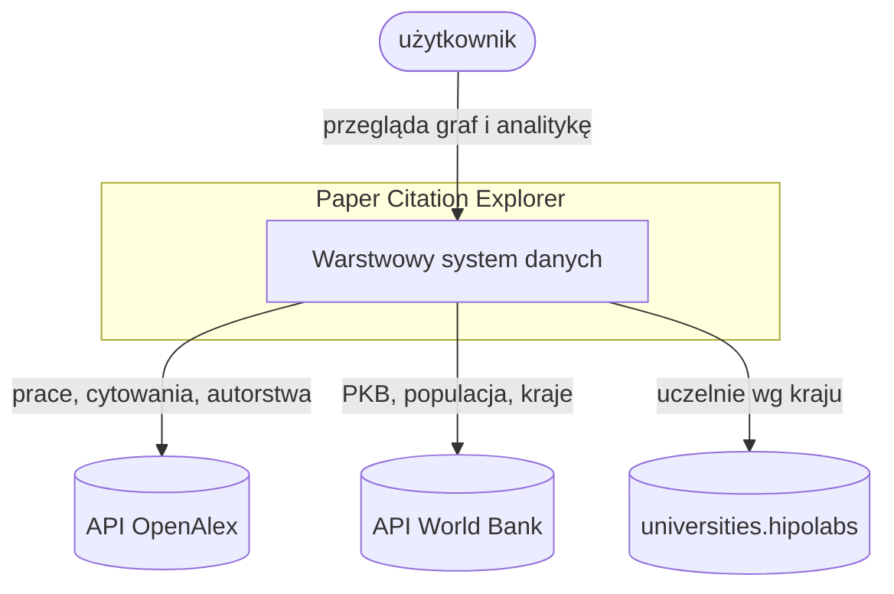
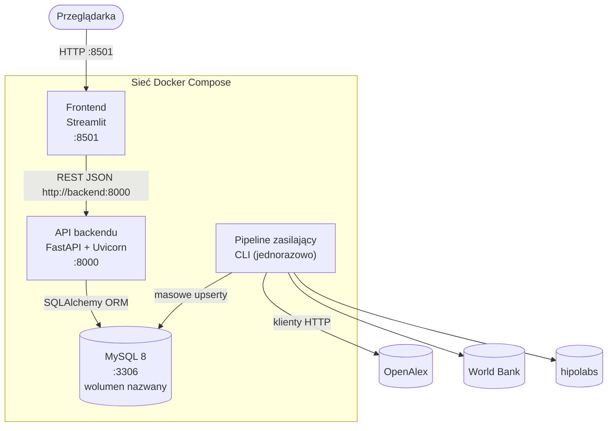
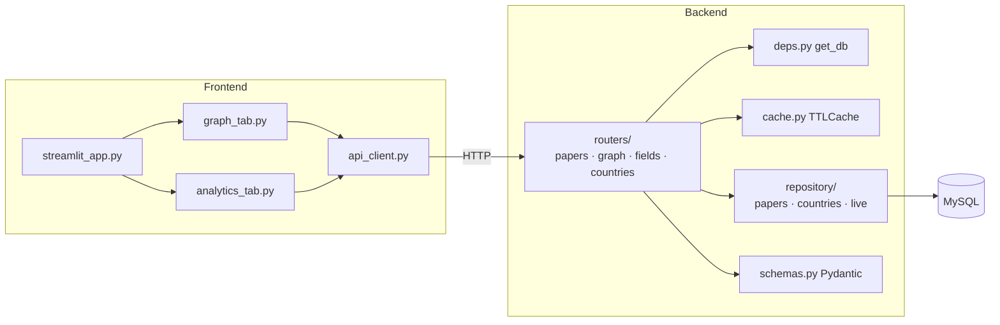
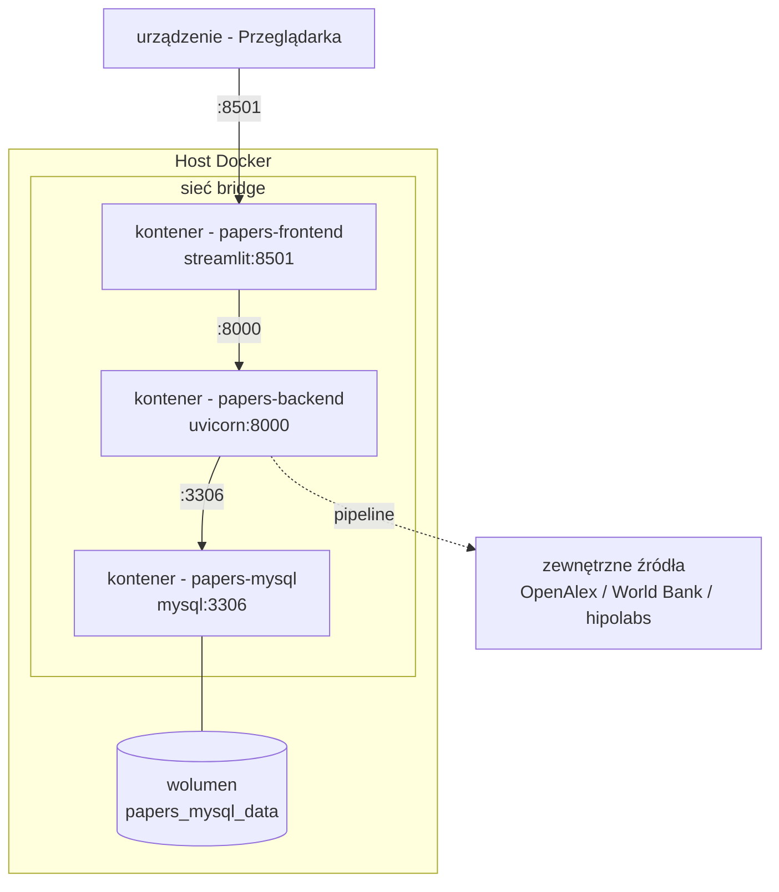

# Architektura


## Warstwy

```
Źródła danych  → ingestion → przetwarzanie → magazyn - MySQL → API backendu → frontend
```

| Warstwa | Odpowiedzialność | Kod |
|---|---|---|
| Ingestion | Typowane klienty HTTP | `app/ingestion/` |
| Przetwarzanie | Dekodowanie abstraktów, normalizacja id, uzgadnianie kodów krajów, wyprowadzanie zbioru krajów + `is_educational` | `app/processing/transform.py` |
| Magazyn | Schemat relacyjny, lista krawędzi cytowań | MySQL 8, `app/db/`, `sql/001_schema.sql` |
| API backendu | REST i Swagger, obsługa błędów | `app/api/`, `app/repository/`, `app/schemas/` |
| Frontend | interfejs Streamlit | `app/frontend/` |

Poza tym:
- Logging loguru
- Walidacja Pydantic,
- orkiestracja z `app/pipeline/`


## Kontekst



---

## Kontener



Frontend komunikuje się tylko z backendem; tylko pipeline sięga do źródeł zewnętrznych. 

---

## Komponent (backend, frontend) 



---

## 5. Diagram wdrożenia UML



## 6. Przepływu żądań

**Zakładka 1 — graf cytowań.** `streamlit_app` → `graph_tab` → `api_client.search_papers`
→ `GET /api/papers/search` → repozytorium → MySQL; wybór pracy źródłowej →
`api_client.get_paper_graph` → `GET /api/papers/{id}/graph` → repozytorium buduje
węzły/krawędzie; kliknięcie węzła → `api_client.get_paper` →
`GET /api/papers/{id}` → prawy panel szczegółów.

**Zakładka 2 — analityka krajów.** `analytics_tab` → `api_client.get_fields` →
`GET /api/fields`; wybór dziedziny/domeny + metryki →
`api_client.field_country_ranking` / `domain_country_ranking` →
`GET /api/fields|domains/{id}/country-ranking` → repozytorium agreguje
`paper_countries ⋈ papers ⋈ countries`, wylicza wskaźniki i zwraca uszeregowaną
tabelę → `st.dataframe` + `st.bar_chart`.
