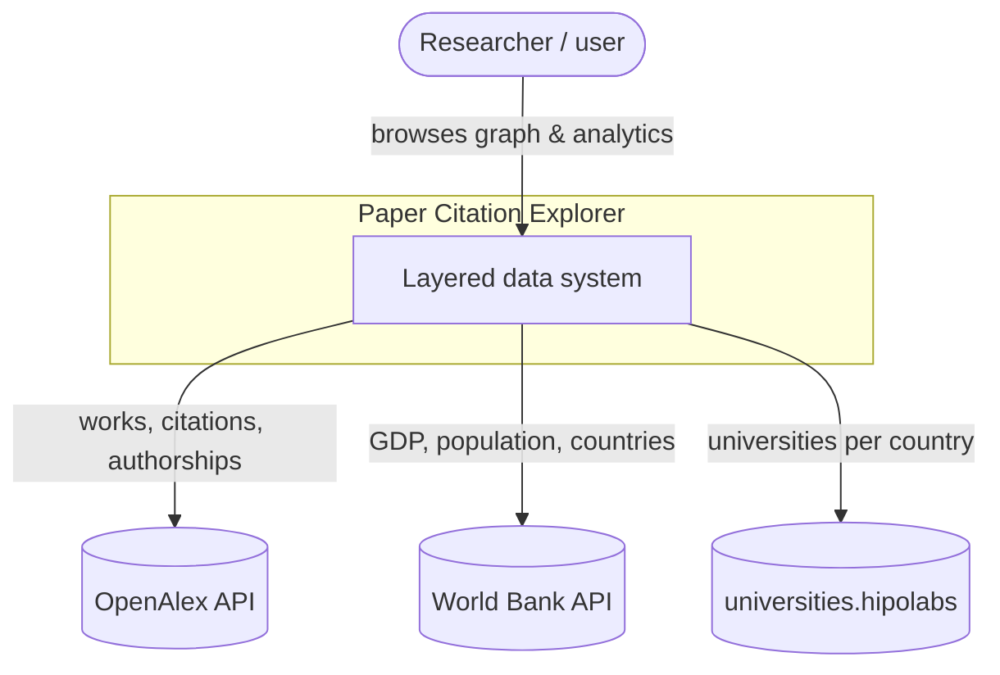
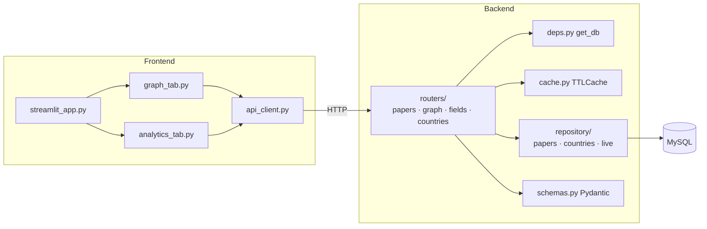
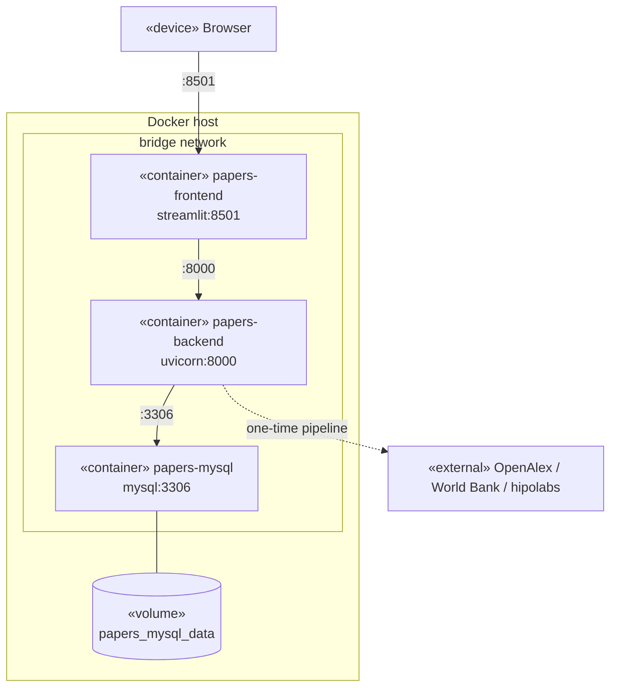

# Architecture

Paper Citation Explorer is a closed, top-down **layered architecture**: every
request flows down through the layers, and the frontend never reaches the
database directly. Open-data sources are integrated at the bottom; the user
interacts only at the top.

See [../CLAUDE.md](../CLAUDE.md) for the full plan, and
[DATABASE.md](DATABASE.md) / [API.md](API.md) / [TECH_CHOICES.md](TECH_CHOICES.md)
for the schema, REST contract and technology justification.

---

## 1. Layered overview

```
Open-data sources  → ingestion → processing → storage (MySQL) → backend API → frontend
```

| Layer | Responsibility | Code |
|---|---|---|
| Ingestion | Typed HTTP clients (cursor paging, retries/backoff) | `app/ingestion/` |
| Processing | Decode abstracts, normalise ids, reconcile country codes, derive country set + `is_educational` | `app/processing/transform.py` |
| Storage | Normalised relational schema, citation edge list | MySQL 8, `app/db/`, `sql/001_schema.sql` |
| Backend API | Typed REST + Swagger, caching, error handling | `app/api/`, `app/repository/`, `app/schemas/` |
| Frontend | Two-tab Streamlit UI (graph + analytics) | `app/frontend/` |

Crosscutting: loguru logging, Pydantic validation, HTTP + Streamlit caching.
Orchestration: the one-time, size-monitored population pipeline (`app/pipeline/`).

---

## 2. C4 — Context (Level 1)



---

## 3. C4 — Container (Level 2)


The frontend talks **only** to the backend; only the pipeline reaches the
external sources, and only the backend and pipeline reach MySQL.

---

## 4. C4 — Component (Level 3, backend + frontend)



---

## 5. UML deployment diagram



---

## 6. Request flow examples

**Tab 1 — citation graph.** `streamlit_app` → `graph_tab` → `api_client.search_papers`
→ `GET /api/papers/search` → repository → MySQL; pick a seed →
`api_client.get_paper_graph` → `GET /api/papers/{id}/graph` → repository builds
nodes/edges; clicking a node → `api_client.get_paper` →
`GET /api/papers/{id}` → right-hand detail panel.

**Tab 2 — country analytics.** `analytics_tab` → `api_client.get_fields` →
`GET /api/fields`; pick a field/domain + metric →
`api_client.field_country_ranking` / `domain_country_ranking` →
`GET /api/fields|domains/{id}/country-ranking` → repository aggregates
`paper_countries ⋈ papers ⋈ countries`, computes ratios, returns the ranked
table → `st.dataframe` + `st.bar_chart`.
