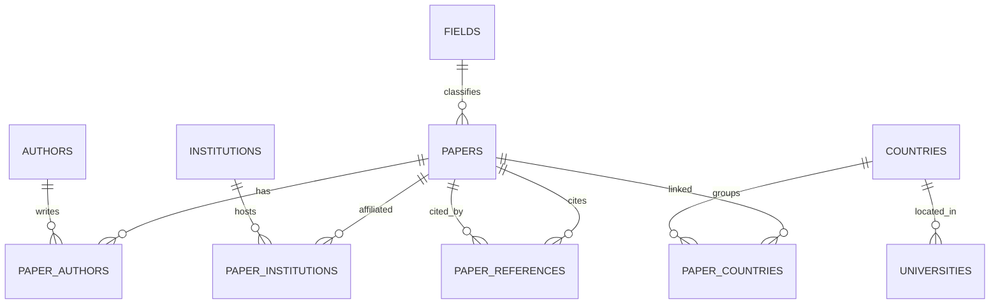

# Database

MySQL 8 (InnoDB, utf8mb4). The authoritative DDL is
[../sql/001_schema.sql](../sql/001_schema.sql); the SQLAlchemy models in
[../app/db/models.py](../app/db/models.py) mirror it exactly and double as the
`create_all` parity net (and the SQLite schema used by the test suite).

---

## 1. Entity-relationship diagram

---

## 2. Tables

| Table | Key columns | Notes |
|---|---|---|
| `papers` | id (PK, short OpenAlex id), doi, title, publication_year, **cited_by_count**, referenced_works_count, is_open_access, oa_status, oa_url, is_educational, primary_field_id/name, primary_domain_id/name, abstract (MEDIUMTEXT), ingested | `ingested=0` = enrichment stub (title + citation count only) |
| `authors` | id (PK), display_name, orcid | shared across papers |
| `institutions` | id (PK), display_name, country_code (ISO-2), type, ror | `type=="education"` drives `is_educational` |
| `paper_authors` | paper_id, author_id, author_position | M:N |
| `paper_institutions` | paper_id, institution_id | M:N |
| `paper_countries` | paper_id, country_code | M:N, **derived**; the Tab 2 join key |
| `paper_references` | citing_id → papers, referenced_id → papers | directed **citation edge list** (cites = out, cited_by = in) |
| `countries` | code (PK ISO-2), iso3, name, gdp_usd, gdp_year, population, population_year, num_universities | merged World Bank + hipolabs |
| `universities` | id (PK), name, country_code, country_name, web_page, domains | hipolabs one-time load |
| `fields` | id (PK), name, domain_id, domain_name | seen in the corpus; Tab 2 dropdown |
| `ingest_runs` | id, scope, started_at, finished_at, papers_ingested, db_size_bytes, status, message | one audit row per completed pipeline run |

---

## 3. Indexing

Indexed for the hot paths: `papers.cited_by_count` (sorting), `papers.primary_field_id`,
`papers.primary_domain_id`, `paper_references.citing_id`,
`paper_references.referenced_id`, `paper_countries.country_code`, and FK indexes
on every link table.

---

## 4. Derived data & integration notes

- **Country set** — a paper has no single country; it is linked to **every**
  ISO-2 country among its authors' institutions (`paper_countries`).
- **Country-code reconciliation** — OpenAlex uses ISO-2, World Bank ISO-3 (plus
  its own `iso2Code` bridge), hipolabs ISO-2 + name. **Canonical key = ISO-2.**
- **`is_educational`** — true when any affiliated institution has `type=="education"`.
- **Abstracts** — decoded from OpenAlex's `abstract_inverted_index`; `null` handled.
- **IDs** — stored in short form (`W2741809807`, `22`); `referenced_works`
  normalised the same way so the edge list joins cleanly.

---

## 5. Ratios served from this schema (Tab 2)

Computed in [../app/repository/countries.py](../app/repository/countries.py),
each guarding against missing/zero denominators (→ `null`, sorted last):

| Response field | Meaning |
|---|---|
| `papers_per_gdp` | papers per 100 billion USD GDP |
| `papers_per_university` | papers per educational institution |
| `papers_per_capita` | papers per million people |

These field names match the `order_by` query enum values exactly (see
[API.md](API.md)).
