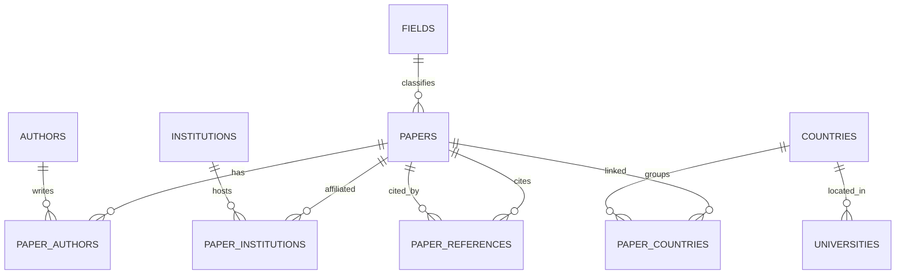

# Baza danych

MySQL 8 (InnoDB, utf8mb4). Główny schemat (DDL) jest w
[../sql/001_schema.sql](../sql/001_schema.sql); modele SQLAlchemy w
[../app/db/models.py](../app/db/models.py) odwzorowują go dokładnie i służą też
jako zabezpieczenie przez `create_all` (oraz schemat SQLite używany w testach).

## Diagram encji i relacji

## 2. Tabele

| Tabela | Główne kolumny | Uwagi |
|---|---|---|
| `papers` | id (PK, krótkie id OpenAlex), doi, title, publication_year, **cited_by_count**, referenced_works_count, is_open_access, oa_status, oa_url, is_educational, primary_field_id/name, primary_domain_id/name, abstract (MEDIUMTEXT), ingested | `ingested=0` = stub z enrichmentu (tylko tytuł + liczba cytowań) |
| `authors` | id (PK), display_name, orcid | współdzielone między pracami |
| `institutions` | id (PK), display_name, country_code (ISO-2), type, ror | `type=="education"` decyduje o `is_educational` |
| `paper_authors` | paper_id, author_id, author_position | M:N |
| `paper_institutions` | paper_id, institution_id | M:N |
| `paper_countries` | paper_id, country_code | M:N, **wyliczane**; klucz złączenia dla zakładki 2 |
| `paper_references` | citing_id → papers, referenced_id → papers | skierowana **lista krawędzi cytowań** (cites = wychodzące, cited_by = wchodzące) |
| `countries` | code (PK ISO-2), iso3, name, gdp_usd, gdp_year, population, population_year, num_universities | scalone World Bank + hipolabs |
| `universities` | id (PK), name, country_code, country_name, web_page, domains | jednorazowy load z hipolabs |
| `fields` | id (PK), name, domain_id, domain_name | widziane w korpusie; lista wyboru w zakładce 2 |
| `ingest_runs` | id, scope, started_at, finished_at, papers_ingested, db_size_bytes, status, message | jeden wiersz audytu na zakończony bieg pipeline'u |

## Dane wyliczane i uwagi o integracji

- Zbiór krajów - praca nie ma jednego kraju; jest powiązana z każdym
  krajem ISO-2 spośród instytucji jej autorów (`paper_countries`).
- Uzgadnianie kodów krajów - OpenAlex używa ISO-2, World Bank ISO-3 (plus
  własny mostek `iso2Code`), hipolabs ISO-2 + nazwa. Klucz kanoniczny = ISO-2
- `is_educational`- true, gdy któraś z powiązanych instytucji ma `type=="education"`.
- Abstrakty - dekodowane z `abstract_inverted_index` OpenAlex; `null` obsłużony.
- ID  przechowywane w krótkiej formie (`W2741809807`, `22`); `referenced_works`
  jest znormalizowane tak samo, żeby lista krawędzi łączyła się czysto.

## Wskaźniki liczone z schematu (zakładka 2)

Liczone w [../app/repository/countries.py](../app/repository/countries.py),
każdy zabezpiecza się przed brakującym/zerowym mianownikiem (→ `null`, sortowany na końcu):

| Pole odpowiedzi | Znaczenie |
|---|---|
| `papers_per_gdp` | prace na 100 mld USD PKB |
| `papers_per_university` | prace na instytucję edukacyjną |
| `papers_per_capita` | prace na milion ludzi |

